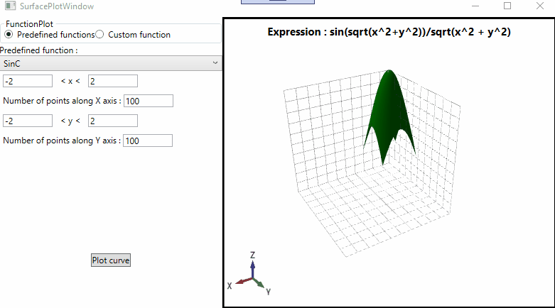

# PlotVisualizer
Created to visualize expressions in 3D plot, which could have been useful when I was learning calculus in school. Uses the expression parser developed in [another project of mine](https://github.com/dularish/ExpressionParser), and also uses [HelixToolKit](https://github.com/helix-toolkit) for the viewport, and MeshBuilder module.

## Demo
 
 
## Run Project

Clone, build and run
